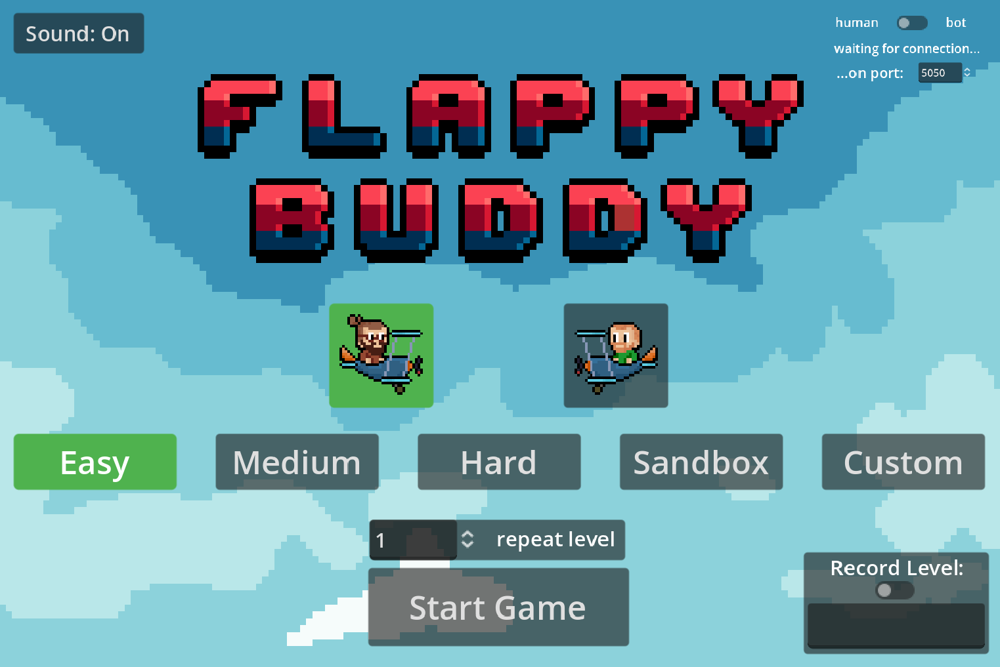
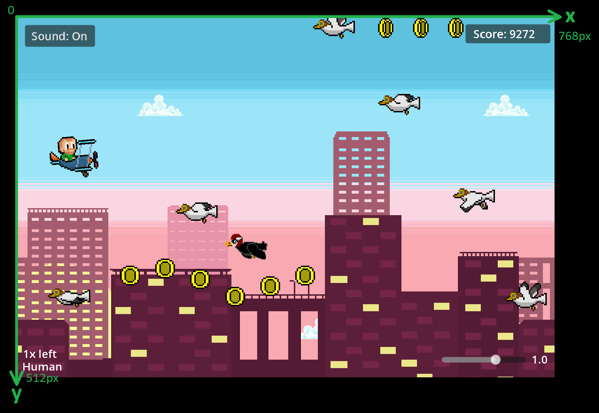
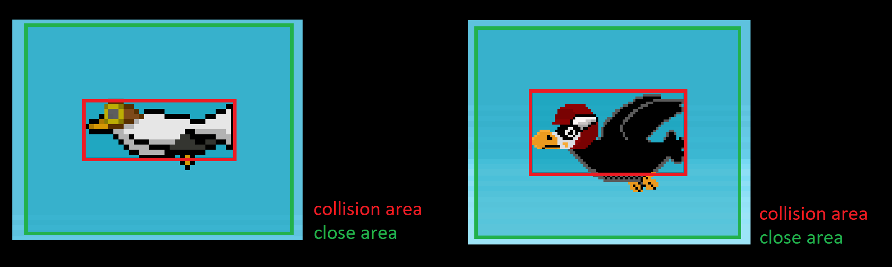

# Willkommen zum KI Wettbewerb "Flappy Buddy" von den Coding Buddies!

Ab dem 24.02.2025 findet unser nächster Programmierwettbewerb statt.

**Grundsätzlich gilt:**

Solltet ihr Fragen haben oder Hilfe benötigen. Scheut euch nicht uns auf unseren Plattformen zu kontaktieren!

**UND ACHTUNG! Der Spaß und das Lernen steht im Vordergrund also macht mit :)** <br>

## Aufgabe

Es ist ein **Bot** zu entwickeln, der die Kontrolle des Fliegers in Flappy Buddy übernimmt. Hierfür haben wir eine
Schnittstelle in den jeweiligen Clients (Java, Python, C# oder Rust) bereit gestellt, welche implementiert werden muss.
Das Ziel ist es die Ziellinie zu erreichen und dabei so viele Münzen wie möglich einzusammeln und Gegnern auszuweichen.
Knacke den Highscore!

## Teilnahmebedingungen

- Implementierung der vorgegebenen Bot Schnittstelle (in der Sprache deiner Wahl)
- Der Bot ist lauffähig und sendet valide Antworten an den Spieleserver
- Die KI ist selbst geschrieben

## Anforderungen

- Python 3.10.4+ (falls der Bot in Python geschrieben wird)
- Java SDK 17+  (falls der Bot in Java geschrieben wird)
- dotnet 8.0 (falls der Bot in csharp geschrieben wird)
- rust 1.84 (falls der Bot in Rust geschrieben wird)

### Was beinhaltet das Repository?

- Das Flappy Buddy Spiel + Source Code Godot
- Die Bot Clients in den jeweiligen Sprachen:
    - Python
    - Java
    - C##
    - Rust

## Das Game starten

Du hast 2 Möglichkeiten das Spiel zu starten:

1) Starte die FlappyBuddy.exe, die im Game Ordner liegt (als zip Datei, also vorher entpacken)
2) Lade dir die Godot Engine hier herunter: https://godotengine.org/. Starte die Engine, klicke auf import. Navigiere in
   den Game-Ordner wo sich die project.godot befindet und klick auf "select current folder" und bestätige mit "Import &
   Edit". Anschließend kannst du das Spiel mit dem "Play" Button in der oberen rechten Ecke der Engine starten. Solltest
   du gefragt werden, welche die Default-Szene des Spiels ist gib "start_menu.tscn" an.

Hast du das Spiel auf eine der beiden Arten gestartet, dann siehst du das Hauptmenü des Spiels.

### Das Hauptmenü

Das Hauptmenü sieht wie folgt aus:\
\
\
Was kannst du einstellen?

1) Du kannst einen Flieger auswählen (Tino oder Fabi). Das ist reine Optik ;)
2) Den Schwierigkeitsgrad: Es gibt Easy, Medium und Hard. Die Level werden immer zufällig generiert.
3) Sandbox Level: Diesen kannst du nutzen, um bestimmte Szenarien an deinem Bot punktgenau zu testen
4) Custom Level: Du kannst alle Level aufzeichnen (Wie liest du weiter unten). Diese Level kannst du über den "Custom"
   Button laden.
5) Über dem Start Game Button kannst du einstellen wie oft eine getroffene Einstellung hintereinander, ohne Pause
   geflogen werden soll (Perfekt um deinen Bot zu trainieren).
6) Record Level: Unten rechts kannst du einstellen, ob ein Level aufgenommen werden soll (default ist aus). Gib dazu
   einen Level Namen im Input Feld ein (Die Datei-Endung ist json und wird automatisch angehängt, das musst du also
   nicht machen). Ein File kannst du bereits laden. Du kannst Files auch nach der Aufnahme selber nach Belieben
   bearbeiten! So hast du keine Grenzen in der Erstellung der Level!
7) Connecte deinen Bot: Wenn das Spiel läuft und du deinen Bot aktiviert hast und dieser sich verbunden hat, siehst du
   oben rechts den Namen deinen Bots stehen. Wenn du von "human" auf "bot" umstellst wird dein Bot beim Starten des
   Spiels den Flieger fliegen. Zusätzlich kannst du bei Bedarf den Port vor der Verbindung deines Bots anpassen.
8) Lets Go! Wenn du alles eingestellt hast, drück auf "Start Game" und los gehts. Probier einfach alles aus :)

### Das Spielfeld

\
\
Das Spielfeld hat einen Viewport von 768px in der Weite und 512px in der Höhe. Der Nullpunkt liegt in der oberen linken
Ecke.
Unten rechts ist es möglich die Geschwindigkeit des Spiels anzupassen (im Bereich zwischen 0 - totaler Stillstand und
1.5 - eineinhalbfache Geschwindigkeit).

### Die Daten

Der Server des Spiels überträgt 60x in der Sekunde folgende Daten (PlayState):

**Überblick**\
Diese JSON-Datei beschreibt den Zustand eines Spiels zu einem bestimmten Zeitpunkt. Sie enthält Informationen über die
Level-Zeit, Hindernisse, den Spieler und die aktuelle Punktzahl.\
\
**Struktur**\
Die JSON-Daten bestehen aus vier Hauptbereichen:

1) level_time: Die verstrichene Zeit des Levels.
2) obstacles: Eine Liste von Objekten (Gegner + Coins) mit spezifischen Eigenschaften.
3) player: Informationen über den aktuellen Zustand des Spielers.
4) score: Die aktuelle Punktzahl.

**Detaillierte Beschreibung der Attribute**\

- level_time: (Typ: float)\
  Beschreibung: Gibt die verstrichene Zeit des Levels in Sekunden an.\
  Beispiel: ````"level_time": 28.0499999999997````
- obstacles: (Typ: Array von Objekten)\
  Beschreibung: Eine Liste von Objekten (Gegner + Coins) im Spiel. Jedes Hindernis ist ein Objekt mit spezifischen
  Eigenschaften.\
  Struktur eines Objekts:

| Attribut          | Typ    | Beschreibung                                                             |
|-------------------|--------|--------------------------------------------------------------------------|
| height            | int    | Höhe des Objekts in Pixeln                                               |
| origin_x          | float  | X-Koordinate des Objekts im Spielraum (Mitte des Objektes in x-Richtung) |
| origin_y          | float  | Y-Koordinate des Objekts im Spielraum (Mitte des Objektes in y-Richtung) |
| type              | string | Typ des Objekts (z. B. "Coin", "Seagull", "Raven")                       |
| width             | int    | Breite des Objekts in Pixeln                                             |
| close_area_height | int    | Höhe des Bereichs für extra Punkte                                       |
| close_area_width  | int    | Breite des Bereichs für extra Punkte                                     |

&nbsp;&nbsp;&nbsp;&nbsp;&nbsp;&nbsp;&nbsp;Anmerkungen:\
&nbsp;&nbsp;&nbsp;&nbsp;&nbsp;&nbsp;&nbsp;height, width: Kollisionsbereich\
&nbsp;&nbsp;&nbsp;&nbsp;&nbsp;&nbsp;&nbsp;close_area_height, close_area_width: Wenn der Flieger diesen Bereich berührt
gibt es extra Punkte\
&nbsp;&nbsp;&nbsp;&nbsp;&nbsp;&nbsp;&nbsp;origin_x, origin_y: Mittelpunkt des Objektes\


&nbsp;&nbsp;&nbsp;&nbsp;&nbsp;&nbsp;&nbsp;Beispiel:

````json
"obstacles": [
{
"height": 28,
"origin_x": 394,
"origin_y": 170,
"type": "Coin",
"width": 28,
"close_area_height": 82,
"close_area_width": 104
},
{
"height": 22,
"origin_x": -39.5,
"origin_y": 352.461273193359,
"type": "Seagull",
"width": 59,
"close_area_height": 82,
"close_area_width": 104
}
]
````

- player: (Typ: Objekt)\
  Beschreibung: Enthält Informationen über die Position, Größe, Rotation und den Zustand des Spielers.\
  Struktur des Spieler-Objekts:

| Attribut | Typ    | Beschreibung                                                        |
|----------|--------|---------------------------------------------------------------------|
| height   | int    | Höhe des Spielers in Pixeln                                         |
| pos_x    | float  | X-Koordinate der Spielerposition (Mitte des Spielers in x-Richtung) |
| pos_y    | float  | Y-Koordinate der Spielerposition (Mitte des Spielers in y-Richtung) |
| rotation | float  | Rotationswinkel des Spielers in Radiant                             |
| state    | string | Status des Spielers (z.B. "start", "alive", "died", "finished")     |
| width    | int    | Breite des Spielers in Pixeln                                       |

&nbsp;&nbsp;&nbsp;&nbsp;&nbsp;&nbsp;&nbsp;Anmerkungen:\
&nbsp;&nbsp;&nbsp;&nbsp;&nbsp;&nbsp;&nbsp;height, width: Bereich des Spielers der mit Objekten kollidieren kann\
&nbsp;&nbsp;&nbsp;&nbsp;&nbsp;&nbsp;&nbsp;pos_x, pos_y: Mittelpunkt des Kollisionsbereichs des Spielers\
&nbsp;&nbsp;&nbsp;&nbsp;&nbsp;&nbsp;&nbsp;state: "start" wird einmal zu Beginn übertragen, während des Fluges hat der
Spieler den state "alive", kollidiert der Spieler mit einem Gegner wird einmal der state "died" übertragen, fliegt der
Spieler ins Ziel wird der state "finished" übertragen.

&nbsp;&nbsp;&nbsp;&nbsp;&nbsp;&nbsp;&nbsp;Beispiel:

```json
"player": {
"height": 26,
"pos_x": 82.0357131958008,
"pos_y": 113.638130187988,
"rotation": -0.00000001862645,
"state": "alive",
"width": 30
}
```

- score: (Typ: int)\
  Beschreibung: Die aktuelle Punktzahl im Level.\
  Beispiel: ````"score": 4603````

### Highscore knacken

Um Punkte zu sammeln gibt es verschiedene Möglichkeiten:

1) Einfach nur fliegen: Du bekommst 1 Punkt pro Frame, also 60 Punkte pro Sekunde, wenn du einfach überlebst
2) Münzen sammeln: Für jede gesammelte Münze gibt es 120 Punkte
3) Heikles Manöver bei Seagull: Wenn du in die "Close Area" der Seagull fliegst (ohne zu kollidieren) gibt es 240 Punkte
4) Heikles Manöver bei Raven: Wenn du in die "Close Area" des Raven fligst (ohne zu kollidieren) git es 360 Punkte
5) Flieg ins Ziel um die Punkte im Turnier zu realisieren

Achte darauf, dass dein Bot seine Antworten rechtzeitig sendet, also nicht zu lange rechnet. Nachrichten werden am
Server nicht gequeued, sondern verworfen.

## Vor dem Start eines Clients
Es ist eventuell notwendig, dass du einige Abhängigkeiten vor dem Start eines Clients installieren musst. Aber in der Sprache deines Vertrauens kennst du dich ja bestens aus. Ansonsten scheue dich nicht im Discord zu fragen!

## Einen Client mit dem Server verbinden (Python)

Den Python Client starten:

```  
cd pythonClient
py bot.py <BotName> <Port>
``` 

| Parameter | Beschreibung                                           |
|-----------|--------------------------------------------------------|
| BotName   | Name der KI, die gestartet werden soll (default: MyAI) |
| Port      | Port des Servers (default: 5050)                       |

Möchtest du beispielsweise die KI FirstAI starten und der Server läuft auf 8765:

```  
py bot FirstAI 8765
```

## Einen Client mit dem Server verbinden (Java)

Den Java Client starten:

```  
cd javaClient   # in den javaClient Ordner wechseln
.\gradlew run   # startet den JavaCleint mit den Standard Settings
```

Um einen anderen Port oder eine andere KI zu verwenden:

```  
.\gradlew run --args="<BotName> <Port>"
``` 

| Parameter | Beschreibung                                           |
|-----------|--------------------------------------------------------|
| BotName   | Name der KI, die gestartet werden soll (default: MyAI) |
| Port      | Port des Servers (default: 5050)                       |

Möchtest du beispielsweise deine eigene KI MyBot starten und der Server läuft auf 5555:

```  
.\gradlew run --args="MyBot 5555"
``` 

## Einen Client mit dem Server verbinden (C#)
Note: Passe eventuell in der CsharpClient.csproj und der Bots.csproj die .net version an die auf deinem System an.

Den C# Client starten <br>
(mit den Settings aus csharpClient\Client\Properties\launch.json)

```
cd csharpClient\Client
dotnet run
```

| Parmeter | Switch         | Beschreibung                                  | Default   |
|----------|----------------|-----------------------------------------------|-----------|
 BotName  | -n or --name   | Name der KI, die gestartet werden soll        | UserBot   |
 Server   | -s or --server | Serveradresse (ip oder dns)                   | localhost |
 Port     | -p or --port   | Port des 4 Connect Servers auf dem Zielserver | 8765      |

Wenn ihr also mehrere Bots geschrieben habt, könnt ihr mit dem Namen das ganze umschalten.
Es ist aber natürlich auch ausreichend den Default zu belassen und alles im "MyAi" zu machen.

